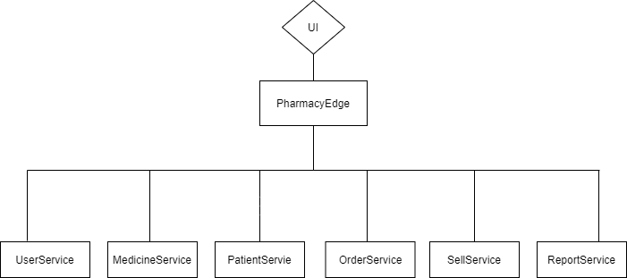
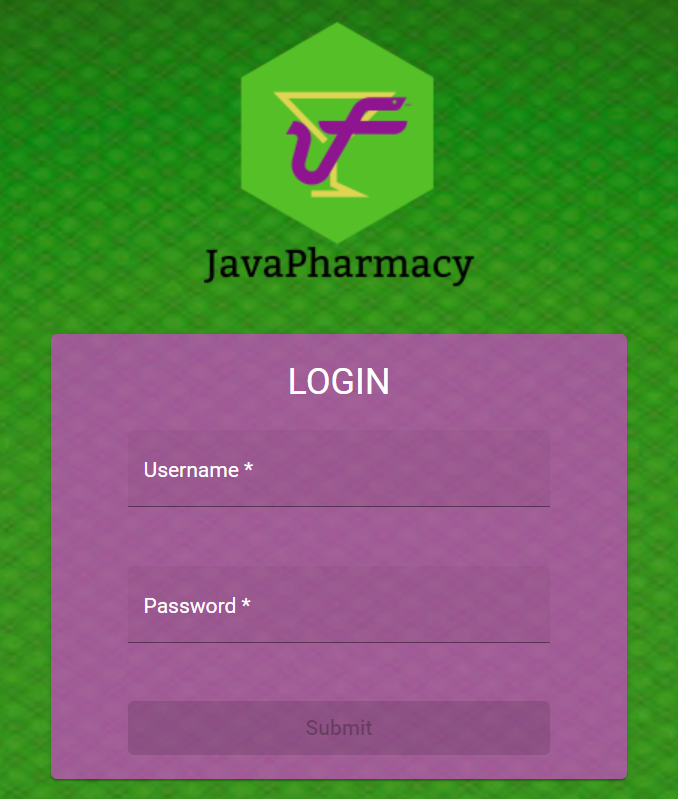

# JavaPharmacy


## Java Bootcamp - Final Project

### Introduction

---

Welcome to JavaPharmacy!! In this project you will be able to take a look at how to develop a program for the management of a pharmacy.

This project aims to show an example of the implementation of concepts and technologies seen during the bootcamp, such as architecture in microservices, TDD methodology or the use of Angular for the UI development among others. Looking forward you enjoy it and that it helps you in any way.


### Methodology

---

This project has been developed using a microservices architecture. There are six microservices with database connection, an edge that acts as an entry point to the application and serves to connect with the previous ones and a "Eureka Server" for the monitoring and registration of all the above mentioned and that can be connected between them through Feign.

In the following image you can see which are the different microservices


*All the microservices have exception handling, log reporting and a coverage test above 80%.

### Tools

---

- Spring
- IntelliJ
- MySQL
- PostMan
- Angular
- Mongo
- Heroku
- db4free
- Firebase

In addition to de above some libraries and framework have been used to make it easier de development of the project as the Spring Cloud Netflix Eureka or Material Angular among others that you may find jumping into the project code

### Functionality

---

This project develops the basic functionality that could be found in a typical pharmacy, which in turn could serve to extrapolate it to similar businesses.
Among others, some of the functionalities you could find, will be:

- Register users and patients
- See the medicine catalogue
- Ordering medicines to have enough to supply patients
- Selling medicines to patients
- Operations registration
- Expiration check
- Some statistics

When you use the project through the interface create you will see different views depending on the role of the user logged.

Priority: *ROLE_OWNER > ROLE_PHARMACIST > ROLE_ASSISTANT*

*You should taking into account that it is a limit time project and there are much more functionalities you cold find in a pharmacy like narcotic drug registration, the prescriptions signing and managing or other financial issues.

They could be develop in some future works!

### How to use it?

---

- Local

This project is in this repository developed, and to be used locally. You can find in the different folders both the different microservices mentioned above and the development of the "front" for the web interface.

First you should check the different *application.properties* in order to see the server.port and to change them in case you have those ports in use in your system. Also you should create a database (in this project case): *pharmacy.*

You also can find some *data.sql* script inside the microservices with database connection to initialize the database, having uncomment the line:

```
spring.datasource.initialization-mode=always
```

To be able to use it you have to first run the Eureka microservice to register the others and then run the rest to provide functionality to the project and make the connection between them work.

Here, in the [Documentation](https://explore.postman.com/api/6579/javapharmacy-finalproject) you can find the everything needed to understand the query possibilities and to find some examples of them. You will be able to check the microservices individually or through the edge service.

*In case you want to test the routes through the PharmacyEdge you should know the routes are protected with authorization and you will have have the UserService running due to it is needed to check the authorization since it is connected with the user database.

**Important**: you have to have at least one user with role: ROLE_OWNER in your database if you want to test all the routes. If you initialize following the before steps you should start with at least two users:

```
user: owner
password: owner

user: assistant1
password: assistant1
```

Please if you do not have one with *ROLE_OWNER* you should insert one for example throug the user microservice directly or through the database with

```sql
insert into user (name, username, password, role) values
('OWNER', 'owner', '$2a$10$4ezwkorIoW.TIwCj2XmKXOAUwpF5G8DZNQyKRWe77AoZlEfWfaK22', 'ROLE_OWNER');
```

To use the front you should also run the code inside Front-End Folder. Node and npm are need to be installed in your system. You have to execute *npm install* and *ng serve* and it will be running in your port localhos:4200 as default.

Once you have all the before said you can start to use the project!

- Deployed

This project is also deployed. It is deployed using different technologies: for the database *db4free*, for the back-end microservices *Heroku*, and for the front-end *Firebase.*

You can use the deployed application visiting [https://javapharmacy.web.app/](https://javapharmacy.web.app/) so there is no need to run it in local in order to test the project. (please bear in mind that when you run the application the first calls could fail because the Heroku servers might be asleep).

*In addition, and **only** if you do not find the reason if it is not working, you could check that the database deployed have inputs (sometimes are removed due to mantenaince fixes). For this purpose you should visit [https://www.db4free.net/phpMyAdmin/index.php](https://www.db4free.net/phpMyAdmin/index.php) and enter with User: *javapharmacyuser* and password: *javapharmacypassword*

You alsa can visit the [Eureka Dashboard](https://eureka-server-javapharmacy.herokuapp.com) in order to see which microservices are already registered.

If you would like to test the routes in the deployed microservices you can do it going to the postman documentation and in the replacing the *http://localhost:{port}* for the microservice deployed base route (You can find them in the postman documentation)

Once you have been able to run the project you will face with the login screen.

Here you have to enter with the user credentials.

Remember you should have at least an owner,   with it password. (If all the steps have gone correctly you should been able to enter with username: *owner*, password: *owner*). 



After going through login screen you will get into the app per se.

There, you will been able to surf through the main navbar:


Rememeber that what you can see and do in the app depend on the user role!!

---

If you have any doubt try to contact with the author, the world is not so big!

Thanks!
